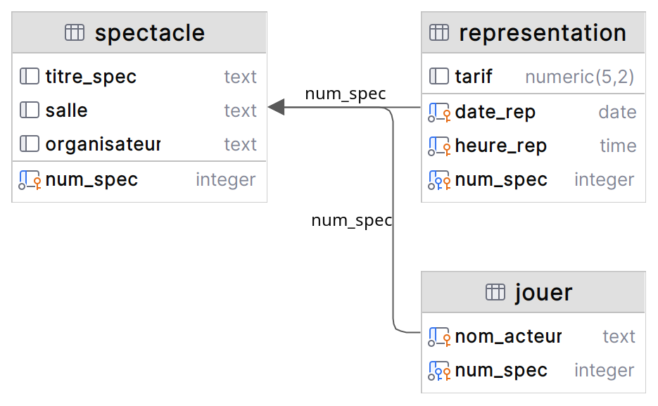

# Description de la base de données

On considère une base de données permettant de gérer des pièces de théâtre. 

De cette base nous avons extrait trois relations : 
- spectacle (<u>num_spec</u>, titre_spec, salle, organisateur) 
- jouer (<u>nom_acteur, num_spec</u>) 
- representation (<u>date_rep, heure_rep, num_spec</u>, tarif) 

Hypothèses de travail : 
- Les spectacles ont lieu à 15h ou à 20h (ou les deux!) 
- Un spectacle donné comprend toujours les mêmes acteurs, quelle que soit la représentation 

## Schéma relationnel
